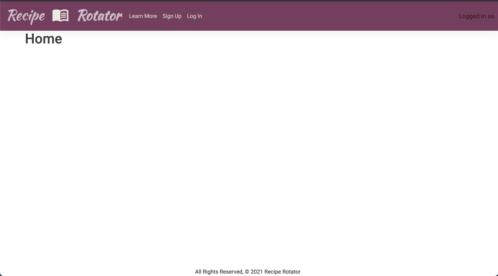
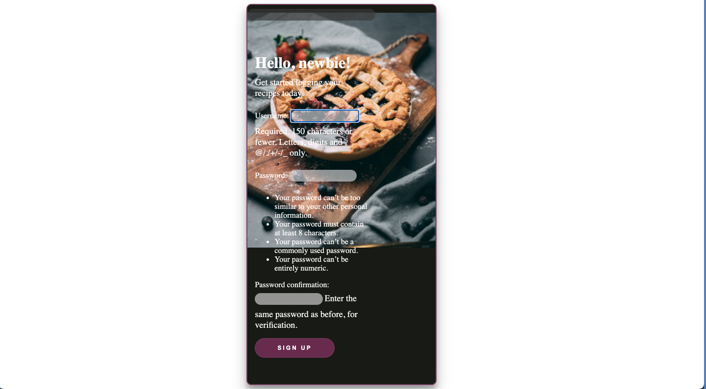
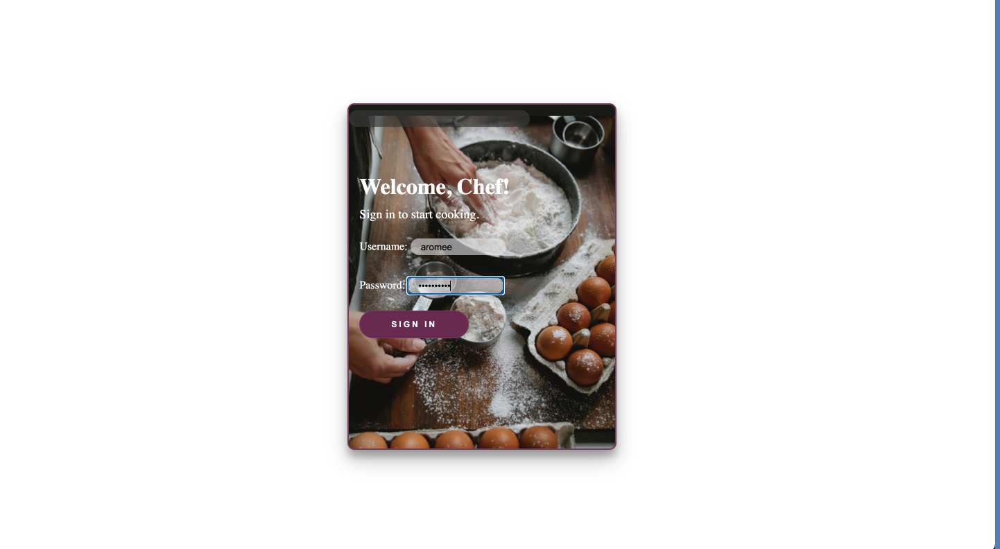
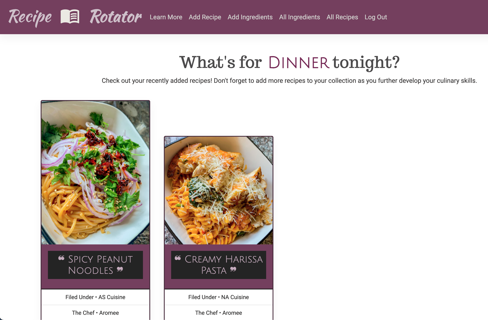
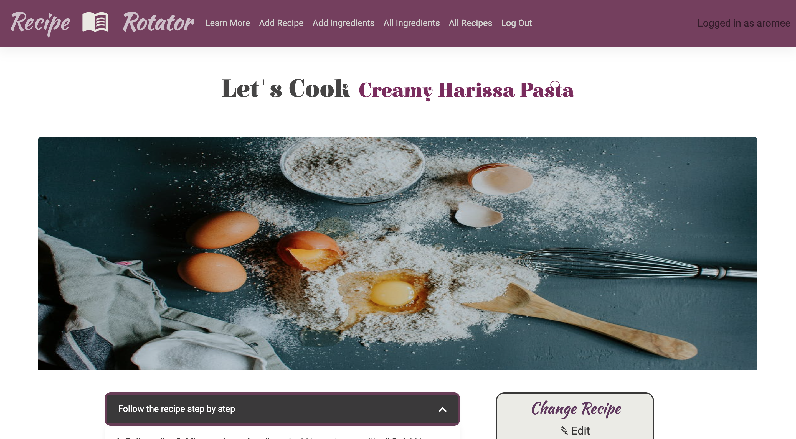
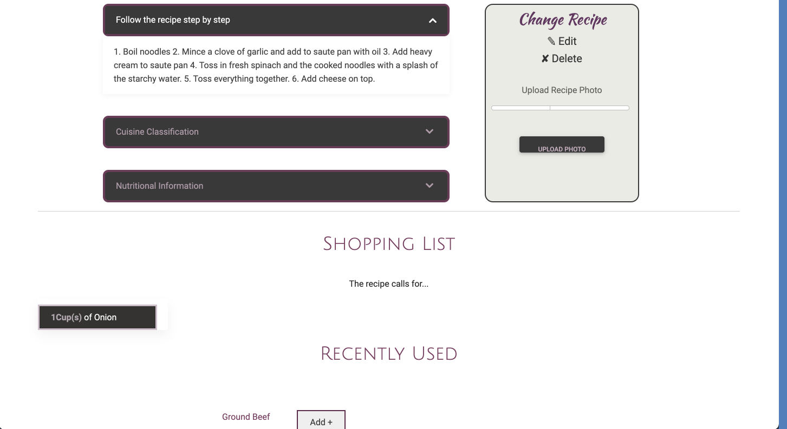
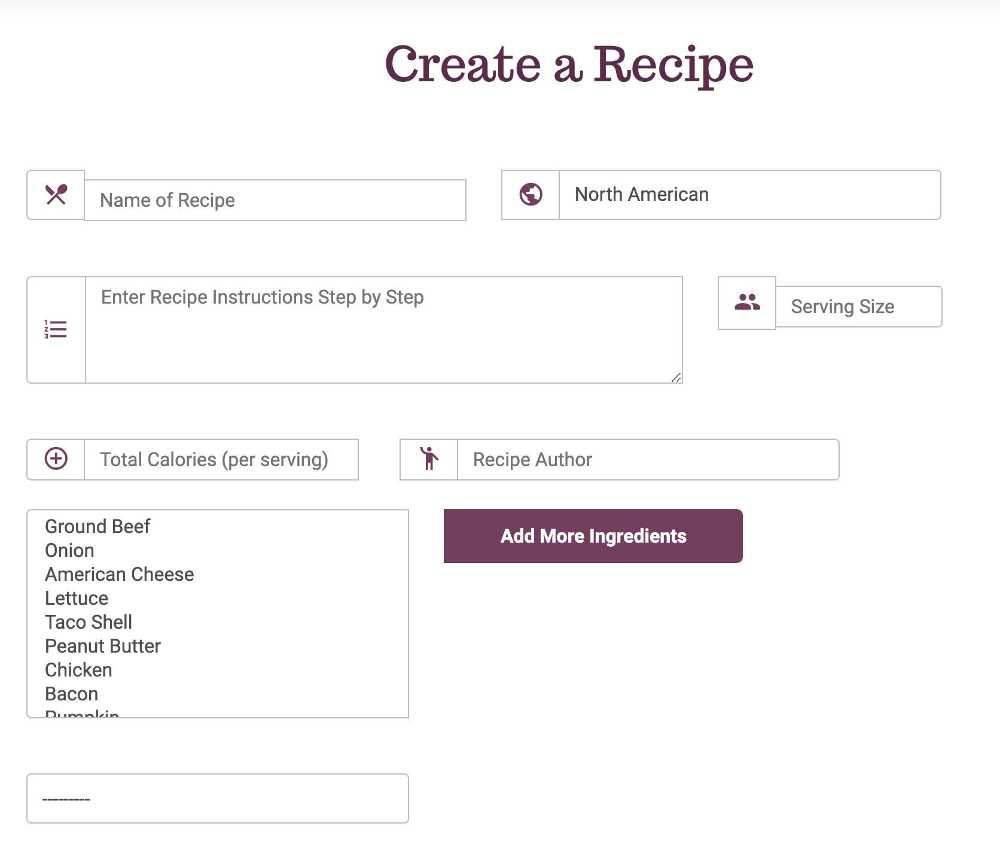

# Recipe Rotator

# Synopsis
Have you ever had a long day at work and thinking about what to make for dinner is the last thing you want to stress about? Stress no more! With **Recipe Rotator**, you can store all of your favorite recipes in one convenient app and have it ready with an ingredient list for a quick and easy trip to the market. No more stressing about what to make or if you'll forget an item on your shopping list because you'll have it with you! 

## App in Use

## Technologies Used 

* HTML
* CSS
* Python
* Django
* PostgreSQL
* Heroku

## Getting Started
[Heroku](https://reciperotators.herokuapp.com/)

[Trello](https://trello.com/b/bXcygyBk/recipe-rotator)

[Pitch Deck](https://docs.google.com/presentation/d/1yaGnhR7Rru__zi_1gcnK5lST5Lc_flURX9BcqzlhlXU/edit?usp=sharing)

## Next Steps (Icebox Features) 

* Update and Delete functions for photos
* Improved UI functionality 
  * Only listing associated ingredients for recipes, rather than the entire list 
  * Ability to view all recipes on the app, not just ones created by the user
* Third-party API integration
  * Ability to bookmark and add recipes from other recipe resources 
